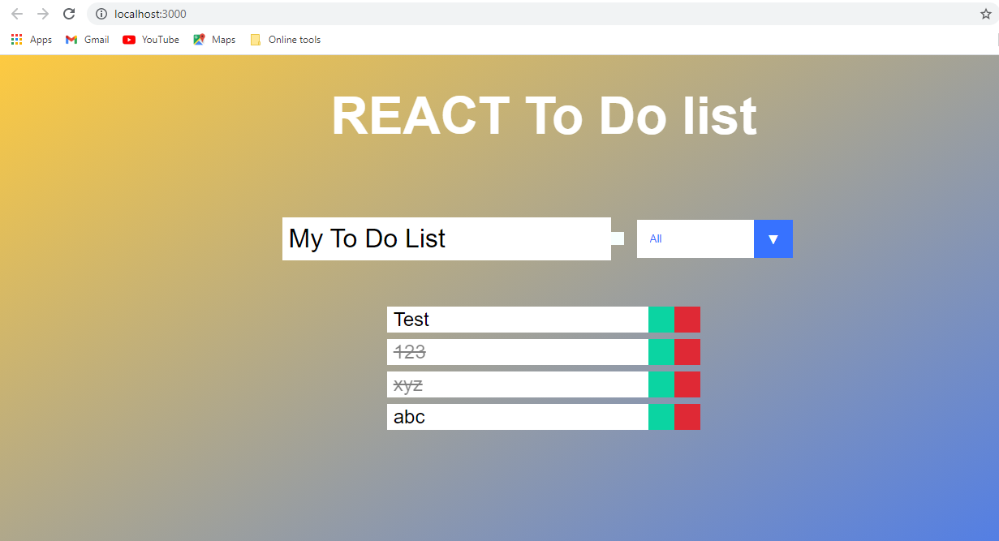

## React To Do List ##

> Consolidate your knowledge about React, components, props, state, and hooks, with this project building a Do To List App.

Additional description about the project and its features.

## Built With

- HTML, CSS, JS
- Linterns, Gitflow
- React, Webpack

## Getting Started

### Prerequisites
You will need an up to date browser to render this website. Also npm to run terminal commands.

### Setup and Install
Get a local copy up and running using git clone https://github.com/herokudev/react-todo-list.git, next we install dependencies with 'npm install'

### Usage
To test the app locally, download source code, install dependencies and excute 'npm start' command.

## Authors (Github: Herokudev)
Herbert Orellana

- GitHub: [@herokudev](https://github.com/herokudev)
- LinkedIn: [LinkedIn](https://www.linkedin.com/in/herbert-armando-orellana-a0b50b34/)

## 🤝 Contributing
Contributions, issues, and feature requests are welcome!

Show your support
Give a ⭐️ if you like this project!

## 📝 License 
This project is MIT licensed.
